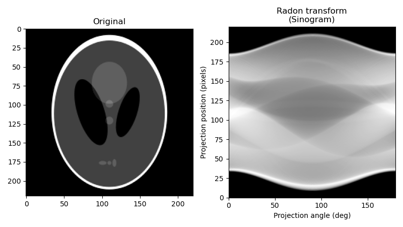

# Filtered Back Projection (FBP)

This code is implementation of radon transform and 
inverse radon transform(using fbp) for image reconstruction.

And the origin author is Poles.

## Algorithm: Filtered Back Projection (FBP)

- Algorithm link: [Radon transform](https://en.wikipedia.org/wiki/Radon_transform)

- Video link: [Filtered Backprojection (FBP)](https://www.youtube.com/watch?v=pZ7JlXagT0w)

### Introduce
link: [Filtered Back Projection](http://www.owlnet.rice.edu/~elec539/Projects97/cult/node2.html)

Filtered backprojection as a concept is relatively easy to understand. 

Let's assume that we have a finite number of projections of an object which 
contains radioactive sources (Fig. A). 

The projections of these sources at 45 degree intervals are represented 
on the sides of an octagon. 

Figure B illustrates the basic idea behind back projection, 
which is to simply run the projections back through the image 
(hence the name `back projection`) to obtain a rough approximation to the original. 

The projections will interact contstructively in regions that correspond to the 
emittive sources in the original image. 

A problem that is immediately apparent is the blurring (star-like artifacts) 
that occur in other parts of the reconstructed image. 
One would expect that a high-pass filter could be used to eliminate blurring, 
and that is the case. 

The optimal way to eliminate these patterns in the noiseless case is through a ramp filter. 

The combination of back projection and ramp filtering is known as filtered back projection.

For parallel beam tomography the projections can be expressed as the Radon transform 
of the object that is to be reconstructed. 
The Radon transform is defined as:

i.e., the line integral along a line (a tomography beam) at an angle  from 
the y-axis and at a distance |s| from the origin. 
By rotating the coordinate system,

or

can be expressed as 

## Install package

- pip install scipy==1.2.0

- pip install matplotlib

- pip install numpy

## Demo

### Original picture
- [Shepp–Logan phantom](https://en.wikipedia.org/wiki/Shepp%E2%80%93Logan_phantom)

or 

### Result

